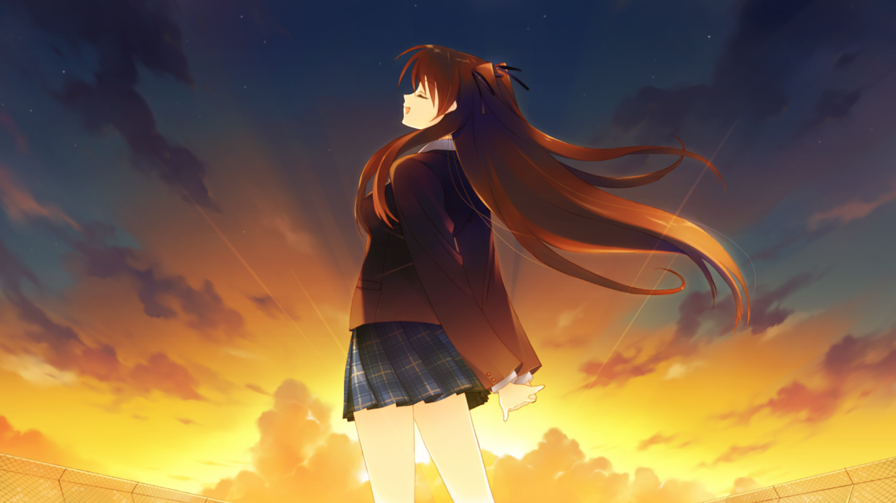
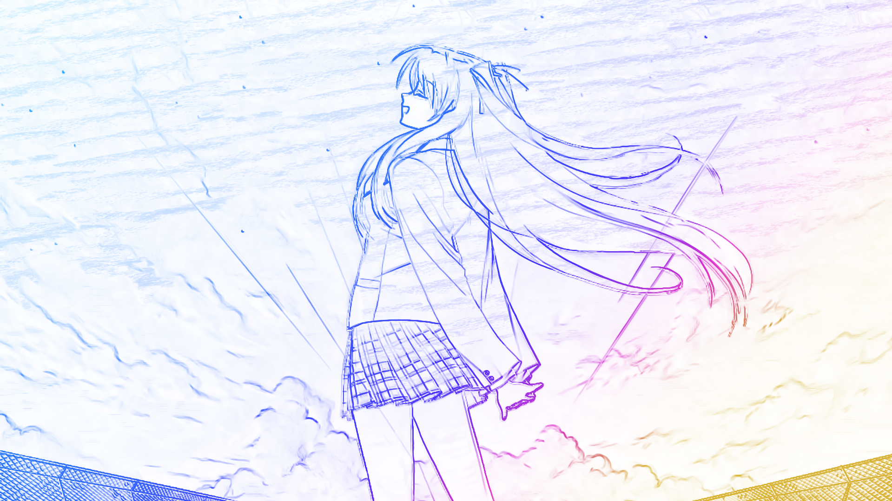

# pencil-art
Convert video/animation frames into Louvre-style colored images using Python.
本项目实现：
- Sobel / Canny 边缘提取  
- 铅笔素描明暗图生成  
- 渐变着色（可自定义颜色）  
- 边缘增强、伽马矫正等多种预处理  
- 支持批处理整个文件夹的图像  
- 输出精美的“卢浮宫风格”效果图！

---

## 📂 示例效果（Examples）

### 🎴 Setsuna 示例

---

### 🎴 Kamome 示例

---

## 📦 项目结构
LouvreFilter/
│── src/
│ ├── main.py # 主程序
│ ├── edge.py # 边缘提取
│ ├── shading.py # 明暗/素描
│ ├── gradient.py # 渐变颜色映射
│ └── utils.py # 工具函数
│
├── examples/ # 示例图片
├── output/ # 输出结果
│
├── README.md
├── requirements.txt
└── .gitignore

🚀 使用方法
1. 处理单张图片
python src/main.py --input input.png --output out.png

2. 处理整个文件夹
python src/main.py --folder ./examples --output ./output

🎨 自定义渐变颜色

在 gradient.py 中修改：

gradient_colors = [
    (0.0, (255, 120, 40)),   # 橙
    (0.4, (255, 80, 60)),    # 红
    (0.7, (255, 40, 100)),   # 紫红
    (1.0, (255, 200, 120))   # 金黄
]

📄 许可证

本项目遵循 MIT License，你可以随意修改、商业使用等。
